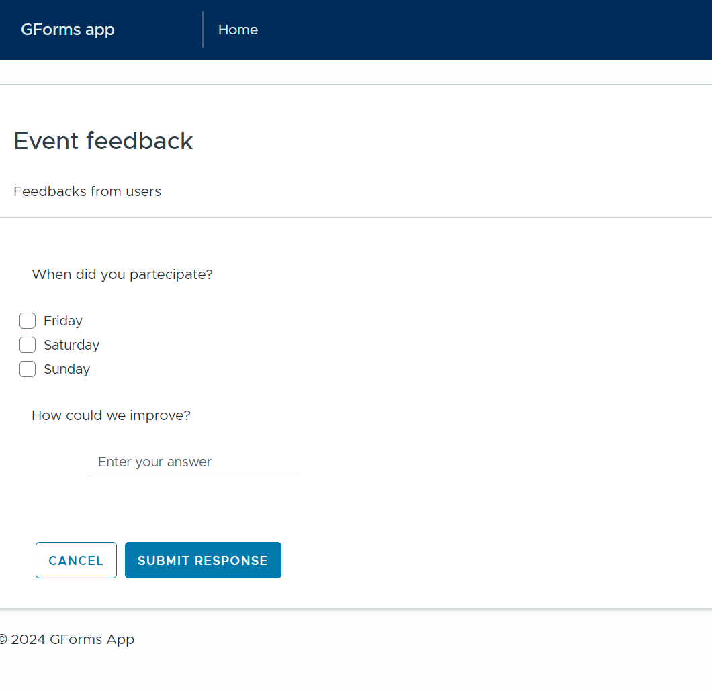
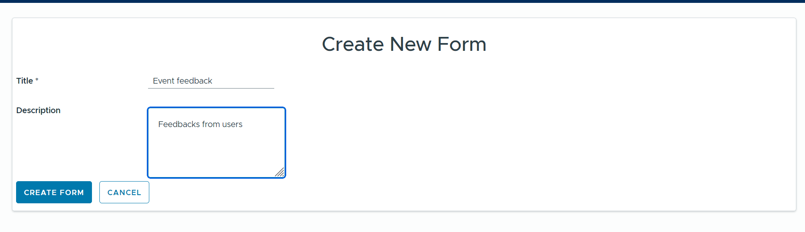
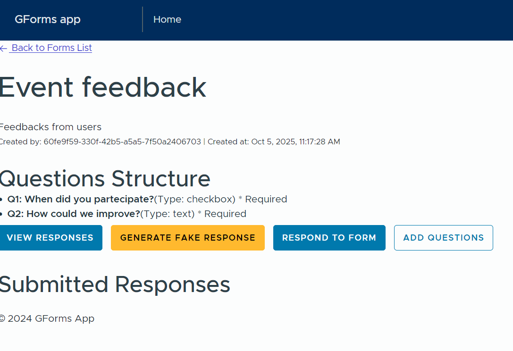

# GForms

GForms is a simple and customizable form builder for your projects.



## Features

- Easy-to-use form builder
- Customizable fields and validation
- Responsive design

- Full support for registration, login, email verification[, password forgot]

- Angular and Go project

## Usage

```bash
docker compose up
```

Open your browser and navigate to `http://localhost:80`.

## Screenshots




